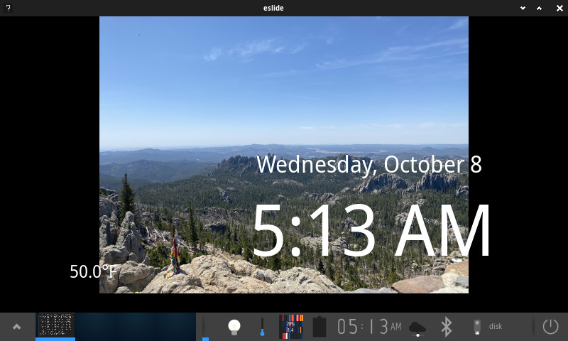

# eslide - EFL Media Slideshow Application

A media slideshow application built with Enlightenment Foundation Libraries (EFL), featuring automatic image/video playback, smooth transitions, and interactive controls.

It is intended to be used as digital picture frame software, but can also be used for general media presentations. It automatically cycles through images and videos in a folder. It provides a slideshow experience with smooth fade transitions, media controls, and an optional digital clock display.



## License and Credits

This application is licensed under the two-clause BSD license.

Built with [Enlightenment Foundation Libraries](https://www.enlightenment.org/).

Icon derived from https://en.wikipedia.org/wiki/File:Projecteur_de_diapositives_Prestinox_d%C3%A9but_des_ann%C3%A9es_1960.jpg 


Icon licensed under [CC BY-SA 3.0](https://creativecommons.org/licenses/by-sa/3.0/deed.en
)

## Key Features

- **Automatic Slideshow**: Cycles through media files every 30 seconds
- **Media Support**: Handles both images and videos
- **Smooth Transitions**: 0.5-second fade transitions between media items
- **Interactive Controls**: On-screen controls for navigation and settings
- **Shuffle Mode**: Randomize playback order
- **Fullscreen Display**: Full-screen presentation mode
- **Digital Clock**: Optional clock overlay with automatic positioning
- **Weather Overlay**: Optional compact weather display updated every 60 seconds
- **News Overlay**: Optional RSS headlines overlay refreshed hourly and rotated every 8 seconds
- **Media Detection**: Automatically scans `./images/` directory or your chosen directory for supported media files

## Architecture

### Core Components

#### 1. **Main Application (`main.c`)**
- Entry point and application initialization
- Coordinates all modules and manages application lifecycle
- Sets up main window and event loop

#### 2. **UI Module (`ui.c/h`)**
- Main window creation and layout management
- Control panel with interactive buttons
- Event handling for user interactions
- Fullscreen and window management
- Compact progress overlay showing "current/total" anchored to content

#### 3. **Slideshow Engine (`slideshow.c/h`)**
- Automatic media progression with configurable timing
- Smooth fade transition animations using Ecore animators
- Media type detection and appropriate display handling
- Timer-based slideshow control

#### 4. **Media Management (`media.c/h`)**
- File system scanning for supported media formats
- Media file cataloging and indexing
- File type detection (images vs videos)
- Dynamic media list management

#### 5. **Clock Module (`clock.c/h`)**
- Digital clock display with automatic updates
- Smart positioning relative to media content
- Toggle visibility functionality
- Timer-based clock updates

#### 6. **Common Utilities (`common.c/h`)**
- Application-wide logging system
- Configuration constants and definitions
- Shared data structures
- Cross-platform compatibility macros

#### 7. **Configuration and Persistence (`config.c/h`)**
- Runtime parsing of CLI options via `Ecore_Getopt`
- XDG Base Directory Specification compliance with backwards compatibility
- Eet-based serialization to XDG location (`~/.config/eslide/eslide.cfg`)
- Automatic fallback to local `eslide.cfg` for existing installations
- Load persisted settings at startup, override with CLI, save on exit

#### 8. **News Module (`news.c/h`)**
- RSS headlines overlay displaying top news titles
- Hourly fetch with compact top-centered overlay and mixed line wrapping
- Title rotation every 8 seconds; toggle visibility via UI button or CLI flags

### Data Flow

1. **Initialization**: Application scans `./images/` directory for media files by default
2. **Display**: First media item is shown immediately
3. **Slideshow**: Timer triggers automatic progression with fade transitions
4. **User Control**: Interactive controls allow manual navigation and settings
5. **Cleanup**: Proper resource deallocation on exit

## Installation and Setup

### What's New in This Version

**XDG Configuration Support**: The application now follows XDG Base Directory Specification for configuration files:
- Configuration is stored in `~/.config/eslide/eslide.cfg` by default
- Maintains full backwards compatibility with existing `eslide.cfg` files
- Automatic migration path for existing users

### Prerequisites

- **EFL (Enlightenment Foundation Libraries)** 
- **libxml2** for XML parsing (weather data)
- **pkg-config** for dependency management
- **GCC compiler** with C99 support

### Building the Application

1. **Clone or download the source code**
2. **Navigate to the project directory**
3. **Check dependencies**:
   ```bash
   make check-deps
   ```

4. **Build the application**:
   ```bash
   make
   ```

5. **Run the application**:
   ```bash
   make run
   # or
   ./eslide
   ```

### Makefile Targets

- `make` or `make all` - Build the application
- `make clean` - Remove build artifacts
- `make run` - Build and run the application
- `make check-deps` - Verify EFL dependencies
- `make install` 
- `make uninstall`
- `make help` - Show available targets

## Usage Guide

### Adding Media Content

Place your image and video files in the `./images/` directory or choose a folder in the UI:
- **Supported Images**: JPEG, PNG, GIF, BMP
- **Supported Videos**: MP4, AVI, MOV, MKV
- **File Naming**: Any valid filename (application scans automatically)

### Choosing Images Folder

You can change the slideshow’s source folder at runtime using the built‑in picker:
- Click inside the media area to show the control panel.
- Click `Folder…` to open the folder chooser.
- Select a directory; the app rescans and starts from the first item.
- The chosen folder is saved to `./eslide.cfg` and used next launch.

Notes:
- Default source is `./images/` if no folder is chosen.
- Command line still supports `--images-dir <path>`; runtime choice overrides it for the session and persists on exit.

### Controls and Navigation

#### On-Screen Controls
- **Next**: Skip to next media item
- **Shuffle**: Toggle random playback order
- **Clock**: Toggle digital clock display
- **Weather**: Toggle compact weather overlay (updates every 60 seconds)
- **News**: Toggle compact news overlay (rotating headlines)
- **Progress**: Toggle compact "index/total" overlay

- **Fullscreen**: Toggle fullscreen mode
- **Close**: Exit application
- **Folder…**: Choose a directory for images/videos (folder-only picker)

#### Mouse Controls
- **Click**: Toggle control panel visibility

### Command Line Arguments

You can override defaults at startup using flags:

- `--interval SECONDS` or `-i SECONDS` — slideshow interval
- `--fade SECONDS` or `-f SECONDS` — fade transition duration
- `--images-dir PATH` or `-d PATH` — directory with media files
- `--fullscreen` / `--no-fullscreen` — start fullscreen or windowed
- `--shuffle` / `--no-shuffle` — enable or disable shuffle mode
- `--clock` / `--no-clock` — show or hide the clock overlay
- `--clock-24h` / `--clock-12h` — select 24-hour or 12-hour time format
- `--weather` / `--no-weather` — show or hide the weather overlay
- `--weather-station CODE` — NOAA station code (default `KNYC`)
- `--news` / `--no-news` — show or hide the news overlay
- `--version` or `-V` — print version information
- `--help` or `-h` — show help

Examples:

```bash
./eslide --interval 8 --fade 0.75
./eslide --images-dir ./pictures --shuffle --clock
./eslide --weather --weather-station KNYC
./eslide --news
./eslide --no-fullscreen --no-shuffle
```

Note: These options are applied at runtime. Slideshow interval and fade duration take effect immediately.

## Technical Details

### Supported Media Formats

**Images**: JPEG, JPG, PNG, GIF, BMP, TIFF, WebP
**Videos**: MP4, AVI, MOV, MKV, FLV, WMV, MPG, MPEG

### Performance Characteristics

## Development Information

### Transition Preloading and Input Debounce

- The slideshow engine uses a hidden Evas image and `evas_object_image_preload` to cache the next image as soon as a fade begins. This reduces disk I/O stalls and visual stuttering when switching media.
- During fade transitions, navigation is guarded by an `is_fading` flag. Rapid next/prev inputs are coalesced into a single pending navigation that runs immediately after the fade completes, preventing overlapping transitions.


### Configuration Persistence

Settings are persisted using Eet following XDG Base Directory Specification:

**XDG Standard Location**: 
- Primary: `~/.config/eslide/eslide.cfg` 
- Custom: `$XDG_CONFIG_HOME/eslide/eslide.cfg` (if `XDG_CONFIG_HOME` is set)

**Backwards Compatibility**: 
- If `eslide.cfg` exists in the current working directory, it will be used instead
- This ensures existing users can continue using their current configuration without migration

**Migration Path**:
- **New installations**: Configuration will be created in the XDG location
- **Existing users**: Your current `eslide.cfg` in the application directory will continue to work
- **Manual migration**: Simply move your `eslide.cfg` to `~/.config/eslide/eslide.cfg`

**How it works**:
1. **Startup**: Application checks for `eslide.cfg` in current directory first (backwards compatibility)
2. **Fallback**: If no local config exists, uses XDG location (`~/.config/eslide/eslide.cfg`)
3. **Directory creation**: XDG config directory is created automatically if needed
4. **Settings merge**: Load persisted settings, then apply CLI overrides
5. **Shutdown**: Save current settings (interval, fade, images dir, fullscreen, shuffle, clock visibility, 12/24h, weather visibility)

This approach allows the app to remember your preferences between runs while following modern Linux standards and maintaining full backwards compatibility.

### Debugging

Enable debug logging by setting environment variable:
```bash
export EINA_LOG_LEVEL=4
./eslide
```

## News Overlay Details

The application displays rotating headlines sourced from the New York Times Home Page RSS feed:
`https://rss.nytimes.com/services/xml/rss/nyt/HomePage.xml`. Headlines are parsed using libxml2
with XPath (`//item/title`). The overlay fetches new data hourly and rotates through the parsed
titles every 8 seconds. It is hidden by default and can be toggled on/off via the on-screen "News"
button or the `--news` / `--no-news` CLI flags.

The headline label is positioned near the top-center of the content area, uses mixed line wrapping
for longer titles, and is styled for readability.
## Weather Overlay Details

The application fetches current conditions from the public NOAA National Weather Service API:
`https://api.weather.gov/stations/<STATION>/observations/latest`. The application requests data in 
NOAA's XML format (`application/vnd.noaa.obs+xml`) and uses libxml2 with XPath for robust parsing.
Only the temperature is displayed in Fahrenheit. The default station is `KNYC`, and it can be 
overridden with the `--weather-station` CLI flag.

The overlay appears in the lower-left of the content area, scaled up for readability, and is
clamped to fit within the visible area. It can be toggled on/off via the on-screen "Weather"
button or the `--weather` / `--no-weather` CLI flags.
